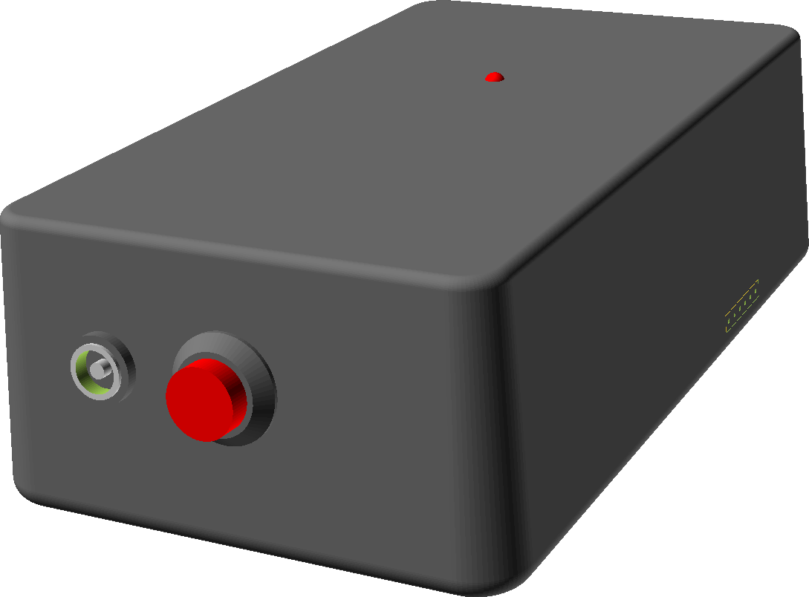
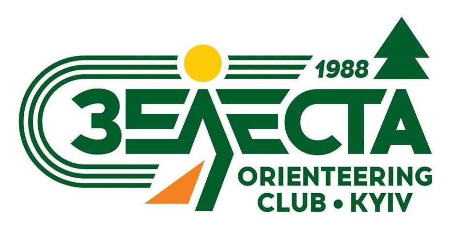

# Arduin-o-punch

Arduino-based punching for orienteering with Mifare NFC cards.

[Facebook: ZELESTAclub](https://www.facebook.com/ZELESTAclub)

In development. The progress can be followed in the YouTube playlist:
[Arduin-o-punch](https://www.youtube.com/playlist?list=PLd7V290LAw4xda5NdMdNRS0adNVE-jHjh).
