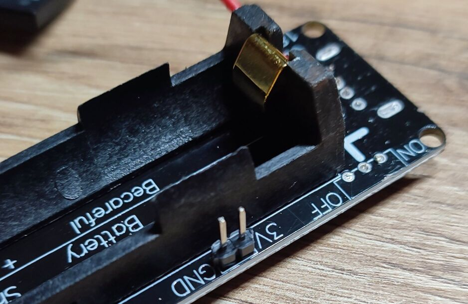

# How to assemble an Arduino station

* Solder header pins to the face surface of Arduino Pro Mini: 
* Solder header pins to the face surface of RC522: 
* Cut off USB output, switch from 18650 power source: 
* Solder header pins to a 3.3v output of 18650 power source: 
* Solder indicator to the 18650 pads of 18650 power source: 
* Glue the indicator to the side of the 18650 power source: 
