# How to assemble an Arduino station

[Українською](assembly.uk.md)

| Step                                                        | Reference picture                                              |
|-------------------------------------------------------------|----------------------------------------------------------------|
| Solder header pins to the face surface of Arduino Pro Mini  | 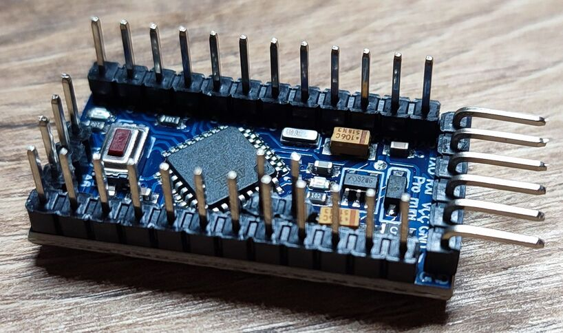     |
| Remove power led from Arduino Pro Mini                      |    |
| Solder header pins to the face surface of RC522             | 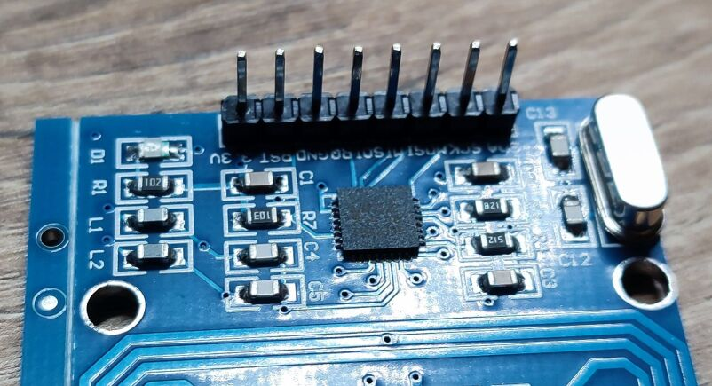       |
| Remove D1 led from RC522                                    |        |
| Remove USB output, switch from 18650 power source           | 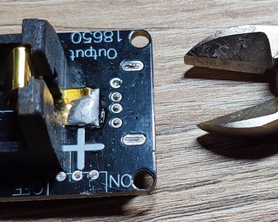             |
| Solder header pins to a 3.3v output of 18650 power source   |        |
| Solder indicator to the 18650 pads of 18650 power source    |         |
| Solder JST 2-pin battery connector |    |
| Cut the charging circuit of DS3231 to allow using non-rechargable CR2032 |   |
| Remove power led from DS3231. Be careful not to break the trace from Bat+ to the pin 14 of the IC! |   |
| Prepare perfboard approximately 10x5 holes                  |        |
| Prepare the required parts: led, active buzzer for 3.3v (5v will also work), 100Ω, 2 5x1 pin headers and a pin header 2x1  |   |
| Solder the parts onto the perfboard (scheme below)          | 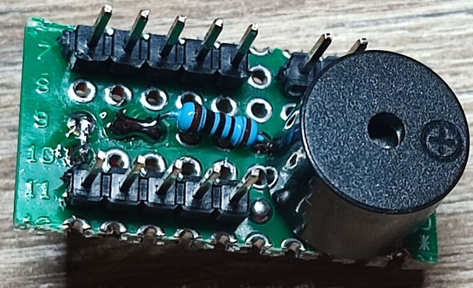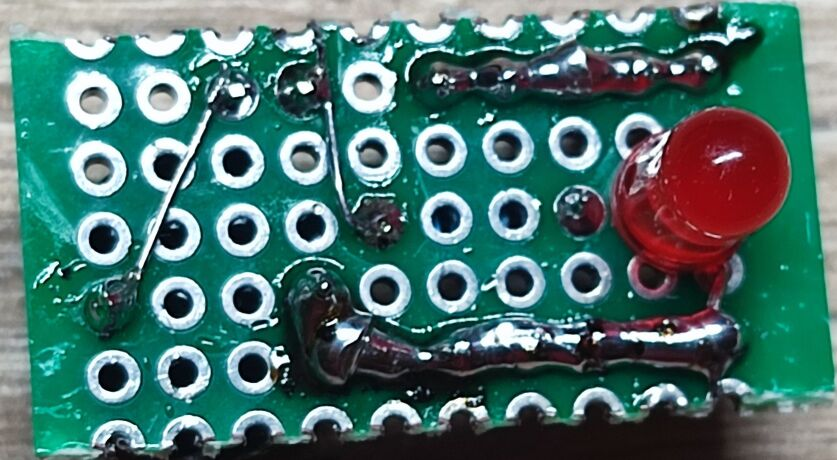   |
| Insert backup battery CR2032 into the clock module          | 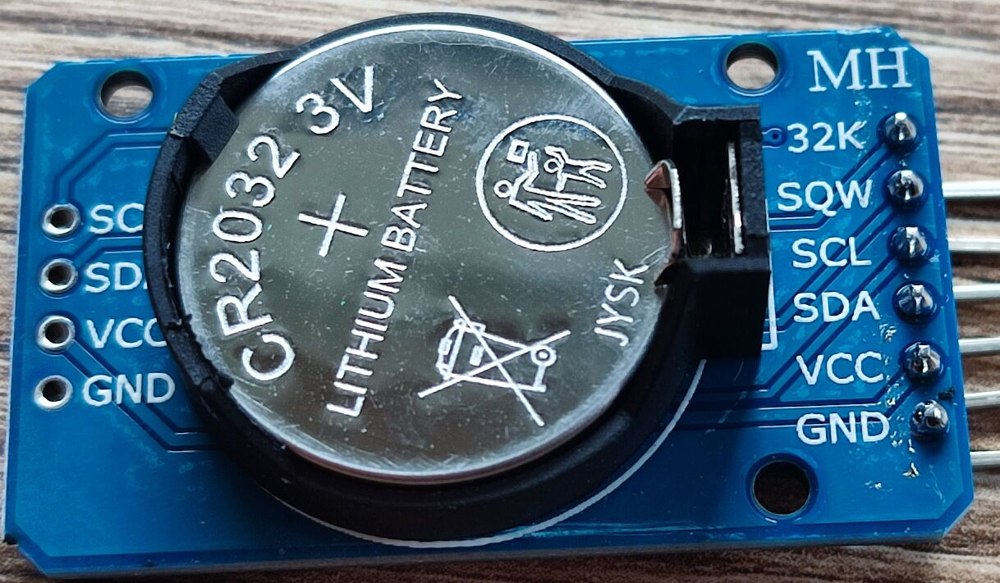    |
| Connect wires between modules (scheme below)                | 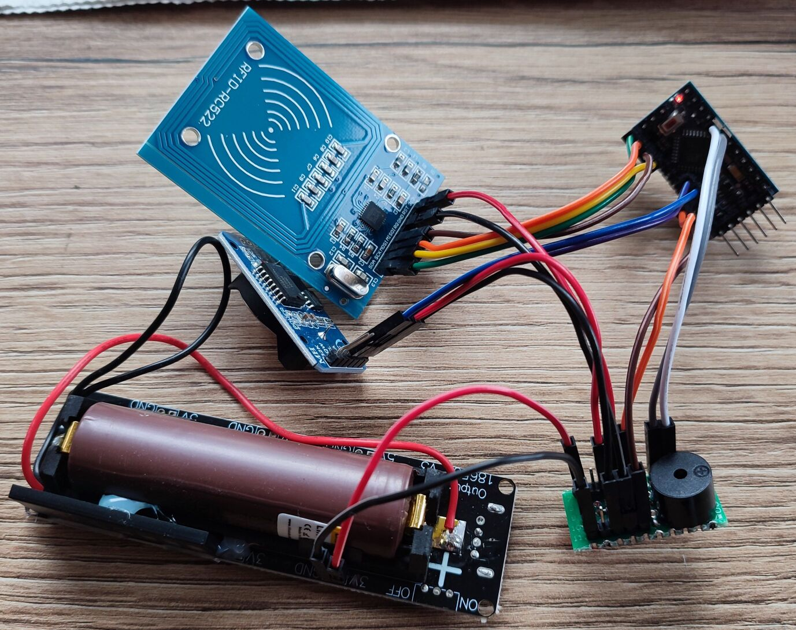           |
| Prepare UART 6P Dupont connector    | 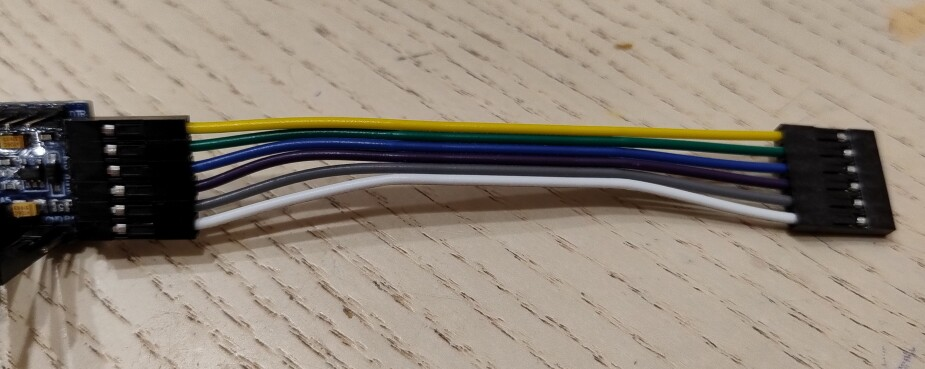 |
| Upload the firmware and test (the procedure below)          |                                                                |

## Soldering scheme

* Two pin headers for negative and positive rails
* Led is placed close to the proximal end on the bottom side, the cathode connected to the negative rail
* Led's anode connected to the resistor 100Ω
* The other end of the resistor to one of the signal pins
* The other signal pin to the positive terminal of the buzzer
* The negative terminal of the buzzer connected to the negative rail

## Wiring scheme

* Clock DS3231: SDA, SCL → A4, A5
* NFC reader RC522: SS, SCK, MOSI, MISO → 10, 13, 11, 12
* Led and buzzer: 4, 5
* All GND to the ground rail of the perfboard with black wires
* RC522 VCC 3.3v to the Arduino's pin 3
* The rest VCC 3.3v to the power rail of the perfboard with red wires
* Power source: GND → ground rail, 3.3v → power rail

The switch the station off, disconnect a wire from the power source.

## Test procedure

* Synchronize the clock
* Configure station id, encryption key
* Punch a test card and verify the punch
* Switch the station off (disconnect from the power source)
* Wait a minute
* Switch the station on
* Check the clock stays set
* Punch a test card and verify the punch

## Encasing

| Step                                                        | Reference picture                                              |
|-------------------------------------------------------------|----------------------------------------------------------------|
| Drill a hole for LED (3mm or 5mm)                           | 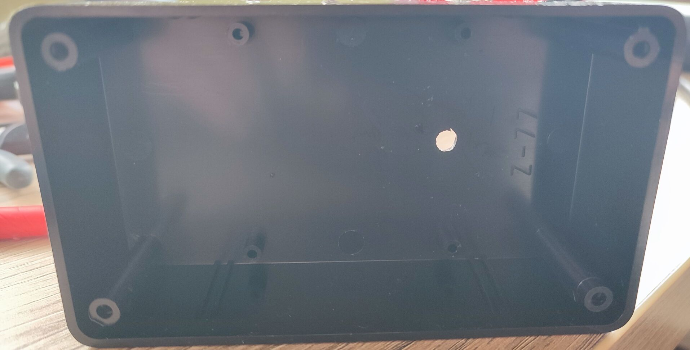              |
| Drill holes for the switch and DC charger input. |    |
| Drill and cut a hole for indicator wires | 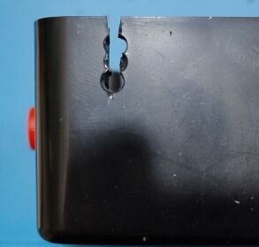 |
| Cut a hole for UART connector 6P Dupont | 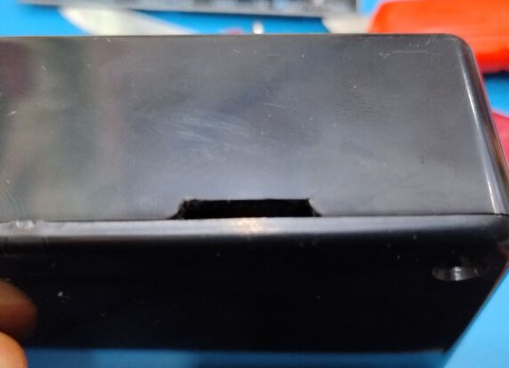 |
| Solder charger wires GND and 5.2V as shown | 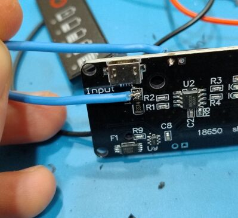 |
| Solder the wires to the DC input and test |  |
| Solder the connector wires to the switch | 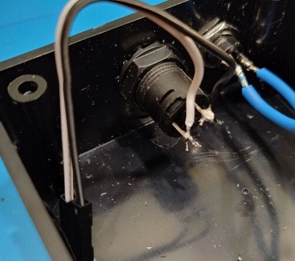 |
