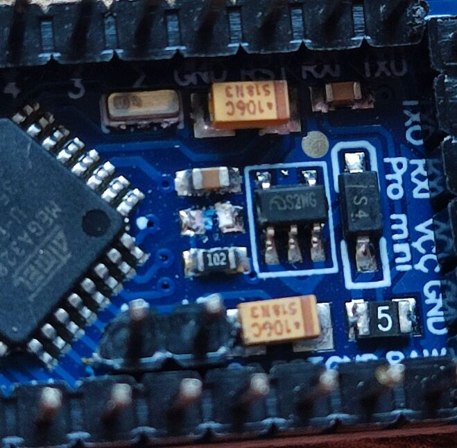

# How to assemble an Arduino station

* Solder header pins to the face surface of Arduino Pro Mini: 
* Remove power led from Arduino Pro Mini: 
* Solder header pins to the face surface of RC522: 
* Remove D1 led from RD522: 
* Remove USB output, switch from 18650 power source: 
* Solder header pins to a 3.3v output of 18650 power source: 
* Solder indicator to the 18650 pads of 18650 power source: 
* Glue the indicator to the side of the 18650 power source: 
* Cut the charging circuit of DS3231 to allow using non-rechargable CR2032: 
* Remove power led from DS3231: 
* Prepare perfboard approximately 10x5 holes: 
* Prepare the required parts: led, active buzzer for 3.3v (5v will also work), 100R, 2 5x1 pin headers and a pin header 2x1: 
