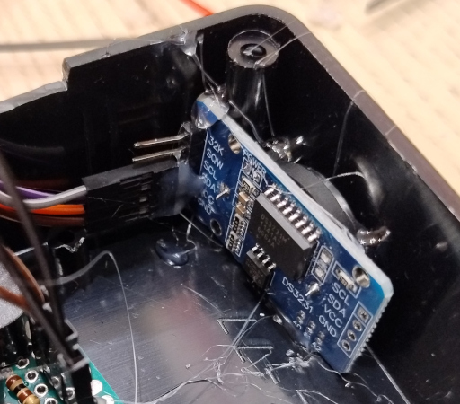

# Як зібрати станцію Arduino

[English](assembly.md)

| Крок                                                        | Ілюстрація                                                     |
|-------------------------------------------------------------|----------------------------------------------------------------|
| Припаяти виводи на лицевий бік Arduino Pro Mini             |      |
| Прибрати індикатор живлення з Arduino Pro Mini              |    |
| Припаяти виводи на лицевий бік RC522                        |        |
| Прибрати світлодіод D1 з RC522                              |        |
| Прибрати вивід USB, вимикач з джерела живлення 18650        |              |
| Припаяти виводи до виходу 3.3 В джерела живлення 18650      |        |
| Припаяти індикатор заряду до полюсів 18650                  |         |
| Припаяти конектор JST-2 для під’єднання батареї |    |
| Розірвати ланцюг заряджання DS3231 щоб застосувати незаряджуваний елемент CR2032 |   |
| Прибрати індикатор живлення з DS3231. Обережно, щоб не пошкодити доріжку від Bat+ до виходу 14 мікросхеми! |   |
| Підготувати макетну плату розміром приблизно 10x5 отворів   |        |
| Підготувати необхідні деталі: світлодіод, активну пищалку на 3.3 В (5 В також підійде), 100Ω, 2 виводи 5x1 і один вивід 2x1  |   |
| Припаяти деталі на макетну плату (схема нижче)              |    |
| Встановити резервний елемент живлення CR2032 в модуль годинника |     |
| З’єднати модулі проводами (схема нижче)                     |            |
| Підготувати для UART з’єднувач 6P Дюпон |            |
| Вивантажити програму і перевірити (процедура нижче)         |                                                                |

## Схема паяння

* Два виводи 5х1 для негативної і позитивної шини
* Світлодіод із зворотного боку з ближчого кінця, катодом до негативної шини
* Анод світлодіода до резистора 100Ω
* Інший кінець резистора до одного із сигнальних виводів
* Інший сигнальний вивід до позитивного терміналу пищалки
* Негативний термінал пищалки до негативної шини

## Схема підключення

* Годинник DS3231: SDA, SCL → A4, A5
* Зчитувач NFC RC522: SS, SCK, MOSI, MISO → 10, 13, 11, 12
* Світлодіод і пищалка: 4, 5
* Всі GND до негативної шини макетної плати чорними проводами
* Всі VCC 3.3 В до позитивної шини макетної плати червоними проводами
* Джерело живлення: GND → негативна шина, 3.3 В → позитивна шина

Для вимкнення станції потрібно від’єднати провід від джерела живлення.

## Процедура тестування

* Синхронізувати годинник
* Сконфігурувати номер станції, код шифрування
* Поставити і перевірити відмітку в тестовій картці
* Вимкнути станцію (від’єднати від джерела живлення)
* Зачекати хвилину
* Увімкнути станцію
* Перевірити, чи годинник показує правильний час
* Поставити і перевірити відмітку в тестовій картці

## Монтування у корпус

| Крок                                                        | Ілюстрація                                                     |
|-------------------------------------------------------------|----------------------------------------------------------------|
| Просвердлити отвір для світлодіода (3 мм або 5 мм) |               |
| Просвердлити отвори для вимикача і гнізда заряджання. |    |
| Просвердлити і вирізати отвір для проводів індикатора |  |
| Вирізати отвір для конектора UART 6P Дюпон |  |
| Припаяти проводи заряджання GND і 5.2 В, як на ілюстрації |  |
| Припаяти проводи до входу DC і перевірити |  |
| Припаяти проводи з конектором до вимикача |  |
| Під’єднати тимчасово акумулятор і проводи живлення, перевірити функціональність |     |
| Укріпити з’єднувачі Дюпон клеєм     |  |
| Приклеїти зчитувачч і материнську плату, просадивши світлодіод у отвір |  |
| Приклеїти годинник |  |
| Приклеїти індикатор заряду акумулятора на зовнішню стінку |  |
| Приклеїти плату живлення |  |
| Під’єднати проводи живлення до материнської плати |  |
| Приклеїти контролер Arduino до бічної стінки |  |
| Встановити акумулятор від електронної цигарки у вільне місце (або вставити 18650 у тримач) |  |
| Приклеїти з’єднувач UART на кришку біля щілини |  |
| Закрити кришку і закріпити шурупами |  |
