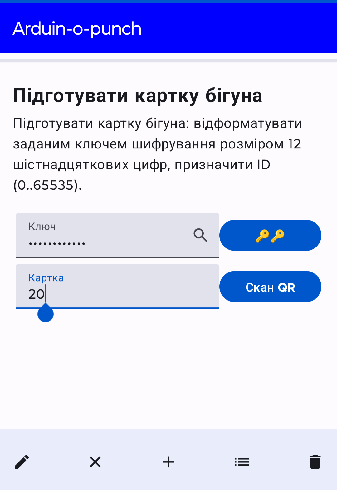
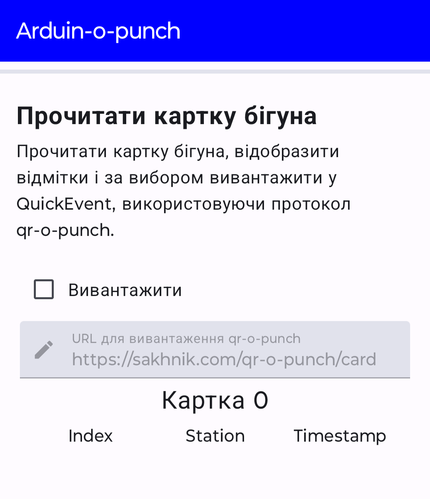
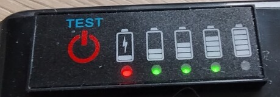

# Користування Arduin-O-Punch

<a href="https://www.facebook.com/ZELESTAclub"></a>

[Facebook: ZELESTAclub](https://www.facebook.com/ZELESTAclub)

Система відмітки [Arduin-O-Punch](https://github.com/sakhnik/arduin-o-punch)
складається із таких частин:

* мобільний додаток на телефоні з андроїдом
* станції розміром 124 х 72 х 32 мм
* перехідник для конфігурації станцій
* картки для відмітки.

Учасники проходять дистанцію із картками і ставлять відмітки на кожному
контрольному пункті, прикладаючи картку до станції.
Мобільний додаток дозволяє підготувати картки учасників на передстартовій
реєстрації та зчитати і надіслати результати після фінішу для обробки у програму
[QuickEvent](https://github.com/Quick-Event/quickbox).
перехідник потрібен для підготовки станцій до змагань: задання ключа шифрування
відмітки, синхронізації годинників, підготовки внутрішньої пам’яті станцій до
запису відміток, перевірки параметрів тощо.

Система змодельована за принципом SPORTIndent, проте є й суттєві відмінності.
Наприклад, не потрібна окрема станція для очищення відміток перед стартом.

## Технічні характеристики системи

| Параметр    |   Значення   |
|-------------|--------------|
| Робоча напруга схеми  |   3.3 В |
| Час роботи станції від повністю зарядженого акумулятора 3000 мА·г | ~7 днів |
| Роздільна здатність годинника  |  1 сек  |
| Точність годинника    |   3.5 ppm ~ 0.3 сек/день |
| Максимальна кількість відміток на картці | 176 |
| Максимальна кількість записів у станції  | 8000 (до 1 підходу)<br/>4000 (до 3 підходів)<br/>2000 (до 15 підходів) |
| Температурний діапазон |   0–40 °C |

## Учасникам

Під час реєстрації видається стартовий номер, який буде використаний у картці
відмітки для ідентифікації учасника. Організатори підготують і видадуть готову
до проходження дистанції картку під час мандатної комісії.

Для успішного проходження дистанції потрібно відмітитися на старті, потім на
всіх контрольних пунктах дистанції у заданому порядку (або й ні залежно від умов
змагань), нарешті на фініші.

Відмітка записується у картку шляхом піднесення до коробки станції до отримання
звукового і видимого підтвердження. Коротний і довгий сигнал «ті-таа», як у
літері А в азбуці Морзе. Якщо одночасно піднесуть свої картки кілька учасників,
станція може поставити відмітку усім, але не обов’язково. При цьому
звуковий сигнал свідчитиме про кількість відмічених карток. Наприклад,
«ті-ті-таа» для двох карток, «ті-ті-ті-таа» для трьох карток і так далі.
Найкраще відмітки ставити по черзі.
Якщо з якоїсь причини місця на картці для відмітки більше немає, станція
повідомить «ті-ті-таа-ті», як літера F в азбуці Морзе.

Результат зчитують після фінішу секретарі змагань з допомогою мобільного додатку
Android. Він автоматично вивантажується у програму QuickEvent для обробки і
відразу видається друкована квитанція. Відмітка продовжує зберігатися на картці
до наступного старту.

Окремої станції для очищення немає і це не потрібно, оскільки попередні відмітки
очищуються на стартовому контрольному пункті.

## Організаторам

### Підготовка станцій до змагань

* Вибрати таємний ключ шифрування 12 шістнадцяткових цифр (0–9, A–F).
* Підготувати тестову картку з допомогою мобільного застосунку Android

Для кожної станцій виконати такі дії:

* Зарядити акумулятори станцій або переконатися з допомогою індикатора, що вони заряджені
* Під’єднати перехідник, перевірити і виправити налаштування:
  - Номер станції має відповідати маркуванню
  - Задати і перевірити ключ шифрування
  - Підготувати журнал відмітки для очікуваної кількості учасників
  - Синхронізувати годинник
* Перевірити правильність відмітки на тестовій картці
* Вимкнути станцію для заощадження заряду

### Розміщення станцій у контрольних пунктах

* Увімкнути станцію
* Прикріпити станцію на рейку
* Перевірити правильність відмітки на тестовій картці

### Підготовка карток перед стартом

* Визначити номер учасника в програмі QuickEvent. Він має співпадати із ідентифікатором чипа
* Відкрити розділ «Підготувати картку бігуна» в застосунку Android
* Задати номер учасника в текстовому полі або відсканувати QR-код реєстрації
    учасника з QuickEvent
* Прикласти чисту картку до телефону і пересвідчитися, що прогрес дійшов до
    кінця і закінчився успішно
* Позначити картку наліпкою із підписаним номером для зручності учасника.

Для зменшення черги учасників можуть обслуговувати кілька секретарів одночасно.

### Зчитування відміток для обробки

* Відкрити розділ «Прочитати картку бігуна» в застосунку Android
* Поставити відмітку «Вивантажити», задати адресу
    `http://quickevent.lan:12345/card`
* Прикласти картку учасника до телефону і дочекатися закінчення зчитування і
    вивантаження

### Після збору станцій

* При потребі під’єднати перехідник-програматор, щоб отримати список відмічених
    карток або щоб перевірити підхід певного учасника
* Вимкнути станцію для заощадження заряду

### Відновлення карток після змагань

* Відкрити розділ «Скинути картку бігуна» в застосунку Android
* Піднести по черзі кожну картку, щоб скинути записаний ключ шифрування у
    початковий стан

Карток може бути багато, тому для краще це виконувати кількома телефонами
одночасно.

## Функціональні частини системи

### Мобільний додаток Android

Початковий код знаходиться у директорії `android`. Додаток можна скласти у
Android Studio. Він не опублікований у Play Marker або деінде. Проте готову
копію можна завантажити за посиланням
[https://sakhnik.com/aop.apk](https://sakhnik.com/aop.apk).

Додаток працює із картками: готує до старту, скидає або ставить відмітку (для
перевірки), зчитує відмітку і скидає картку в початковий стан. Для виконання
будь-якої з цих дій потрібно вибрати відповідну сторінку в лівій панелі, ввести
бажані параметри у відповідні поля і піднести картку до зворотного боку
смартфону. Успішну операцію підтверджує звуковий сигнал. Якщо ж картку
передчасно забрати або стається будь-яка інша помилка, буде подано сигнал
помилки і на екрані з’явиться коротке повідомлення з подробицями.





### Станція Arduin-o-punch

Це чорна закрита коробка із такими частинами:

* Вимикач
* Вхід для заряджання 5 В 5,5х2,1 мм
* Індикатор заряду акумулятора
* Гніздо для приєднання програматора USB-UART
* Світлодіод для індикації
* Пищалка всередині корусу, яка повторює сигнали світлодіода
* Безконтактний зчитувач карток NFC Mifare

### Акумулятор

Для заряджання акумулятора потрібно під’єднати зарядний пристрій до гнізда
заряджання DC 5,5х2,1 мм.

Рівень заряду акумулятора можна перевірити, натиснувши на кнопку увімкнення
індикатора.



### Програмування

Arduino Pro Mini, використаний у базовій станції, не має власного виходу USB.
Під’єднання до комп’ютера для програмування чи конфігурування здійснюється з
допомогою програматора-перехідника USB-UART. Під час під’єднання перехідника
контролер перевантажується.


Для програмування контролера потрібно виконати команду `arduino-cli compile -m
pro -u` в директорії `arduino`:

```
~/work/orienteering/arduin-o-punch/arduino main*
$ arduino-cli compile -m pro -u
Sketch uses 22848 bytes (74%) of program storage space. Maximum is 30720 bytes.
Global variables use 1046 bytes (51%) of dynamic memory, leaving 1002 bytes for local variables. Maximum is 2048 bytes.

Used library   Version Path
arduino-timer  3.0.1   /run/media/sakhnik/Android/Arduino/libraries/arduino-timer
CircularBuffer 1.3.3   /run/media/sakhnik/Android/Arduino/libraries/CircularBuffer
RTClib         2.1.1   /run/media/sakhnik/Android/Arduino/libraries/RTClib
Adafruit BusIO 1.14.4  /run/media/sakhnik/Android/Arduino/libraries/Adafruit_BusIO
Wire           1.0     /run/media/sakhnik/Android/.arduino15/packages/arduino/hardware/avr/1.8.6/libraries/Wire
RFID_MFRC522v2 2.0.4   /run/media/sakhnik/Android/Arduino/libraries/RFID_MFRC522v2
SPI            1.0     /run/media/sakhnik/Android/.arduino15/packages/arduino/hardware/avr/1.8.6/libraries/SPI
EEPROM         2.0     /run/media/sakhnik/Android/.arduino15/packages/arduino/hardware/avr/1.8.6/libraries/EEPROM

Used platform Version Path
arduino:avr   1.8.6   /run/media/sakhnik/Android/.arduino15/packages/arduino/hardware/avr/1.8.6
```

### Командна оболонка

До запрограмованої станції при під’єднаному акумуляторі можна під’єднатися через
послідовний порт `/dev/ttyUSB0` у Linux з допомогою команди `screen /dev/ttyUSB0
9600` або скористатися будь-якою іншою термінальною програмою. При під’єднанні
контролер перевантажується і демонструє запрошення ввести команду:

```
Arduin-o-punch>
```

Перша команда, яку потрібно знати, `help`:

```
Arduin-o-punch> help
Commands:
info              All info
id                ID
id 33             Set ID: check=1 start=10 finish=255
key               Key
key 112233445566  Set key
clock             Clock reading (ms)
clock 12345000    Set clock (ms)
date              Current date
time              Current time
timestamp         Print UNIX timestamp
timestamp 12345   Set date and time with UNIX timestamp
recfmt 256 2      Clear/prepare recorder (card count, bits per record)
rec               List punched cards
rec 123           Print punch count for a card
recclr 123        Clear card from the record
recdays           How many days to keep the record
recdays 1         Clear record after so many days
Arduin-o-punch>
```

Це підказка із списком підтримуваних команд і їхніх аргументів.
Друга важлива команда — `info`:

```
Arduin-o-punch> info
version=1.1.0
id=41
key=112233445566
date=2024-02-18
time=13:57:58
rec=256 x 2 bpr
recdays=1
Arduin-o-punch>
```

Вона друкує актуальний статус станції: версію програми, номер станції, ключ
шифрування, час годинника, розмір журналу відмітки. Про всі ці команди
детальніше в наступних розділах.

Для виходу з програми `screen` потрібно натиснути `ctrl-a`, ввести команду
`:quit` і натиснути `enter`.

### Номер станції

Номер станції — це число від 0 до 255. Воно записується в картку разом із
поточним часом щоб поставити відмітку. Деякі номери зарезервовані і мають
спеціальне значення:

|  Номер  |   Значення  |
|---------|-------------|
| 1       | Станція перевірки (зарезервовано) |
| 10       | Старт (попередня відмітка скидається) |
| 255      | Фініш    |

Будь-який інший номер можна використати для контрольного пункту. Традиційно
застосовують номери 31, 32, 33,… , 100.

Для перевірки номера станції і задання нового потрібно використати команду `id`:

```
Arduin-o-punch> id
41
Arduin-o-punch> id 45
45
Arduin-o-punch>
```

## Ключ шифрування

Інформація на картці захищена від запису сторонніми програмами ключем довжиною
12 шістнадцяткових цифр. Це стандартна можливість карток Mifare. На кожний захід
потрібно обирати новий ключ, щоб убезпечити результат змагань від підробки.
Справді, будь-хто, хто знає ключ шифрування може скористатися застосунком
Android, щоб поставити потрібні відмітки на свою картку. З іншого боку судді
повинні знати ключ шифрування, щоб готувати картки перед змаганнями, зчитувати
результати для надсилання їх для обробки і для відновлення карток в початковий
стан після фінішу.

Для конфігурування станції слід скористатися командою `key`:

```
Arduin-o-punch> key
FFFFFFFFFFFF
Arduin-o-punch> key 112233445566
112233445566
Arduin-o-punch>
```

При зміні ключа станція подає сигнал успішної відмітки.

### Годинник

Щоб мати надійні достовірні результати потрібно щоб всі станції працювали
синхронно, тобто щоб годинники у станціях показували однаковий час. Взагалі-то,
це не є геть обов’язковою умовою. Наприклад, якщо всі учасники отримують
стартову і фінішну відмітку на одних і тих самих станціях, лідери так само
залишаться лідерами в підсумку. Навіть незважаючи на, можливо, неправильні
значення темпу. Проте якщо всі станції показують однаковий час, тоді можна
отримати правильний розрахунок темпу при відвідуванні кожного контрольного
пункту.

Станції послуговуються точним годинником справжнього часу з резервним елементом
живлення CR2032, заряду якого має вистачити на кілька років.

Для синхронізації годинника потрібно під’єднати програматор і запустити на
комп’ютері скрипт `sync-сlock.py`.

```
$ virtualenv /tmp/venv
created virtual environment CPython3.11.6.final.0-64 in 501ms
  creator CPython3Posix(dest=/tmp/venv, clear=False, no_vcs_ignore=False, global=False)
  seeder FromAppData(download=False, pip=bundle, setuptools=bundle, wheel=bundle, via=copy, app_data_dir=/home/sakhnik/.local/share/virtualenv)
    added seed packages: pip==23.3.2, pyserial==3.5, setuptools==69.0.3, wheel==0.42.0
  activators BashActivator,CShellActivator,FishActivator,NushellActivator,PowerShellActivator,PythonActivator

$ source /tmp/venv/bin/activate

venv $ pip install -r requirements.txt
Requirement already satisfied: pyserial in /tmp/venv/lib/python3.11/site-packages (from -r requirements.txt (line 1)) (3.5)

venv $ ./sync-clock.py
Before: clock=55224357 time=15:20:24
After: 2024-02-18 15:20:23

venv $
```

### Журнал відмітки

Записування відмічених карток у станції може знадобитися для додаткового
підтвердження відмітки. Для активування цієї функції потрібно оцінити очікувану
кількість учасників (максимальний стартовий номер) і кількість підходів одного
учасника на цей конкретний контрольний пункт. Наприклад, у центральній точці
«метелика» очікується кілька відвідувань.

```
recfmt <найбільший номер> [1|2|4|8]
```

|   Кількість бітів    |   Кількість підходів   |   Максимальний стартовий номер |
|----------------------|------------------------|--------------------------------|
|   1   | 0–1   |  8000  |
|   2   | 0–3   |  4000  |
|   4   | 0–15  |  2000  |
|   8   | 0–255 |  1000  |

Кількість бітів потрібно вибирати ощадливо, тому що кількість циклів записування
у внутрішню пам’ять обмежена приблизно 10000 разів.

Журнал очищується автоматично при увімкненні станції після `recdays` днів:
```
Arduin-o-punch> recdays
0
Arduin-o-punch> recdays 1
1
Arduin-o-punch>
```
Значення 0 означає не очищувати журнал автоматично, 1 очищувати, якщо станція
вмикається на наступний день після попереднього очищення, 2 — через два дні і
так далі. Це може знадобитися для багатоденних змагань, щоб не доводилося
очищувати журнал командою програматора `recfmt`.

Щоб вивести список відмічених карток, можна скористатися командою `rec`:
```
Arduin-o-punch> rec
Size=256
 90:1 91:1 92:1 93:1 123:1
Arduin-o-punch>
```

Щоб перевірити, скілька разів було відмічено одну певну картку, та сама команда
тільки з аргументом `rec 123`.
```
Arduin-o-punch> rec 123
1
Arduin-o-punch>
```
